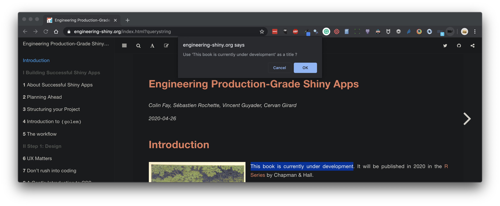
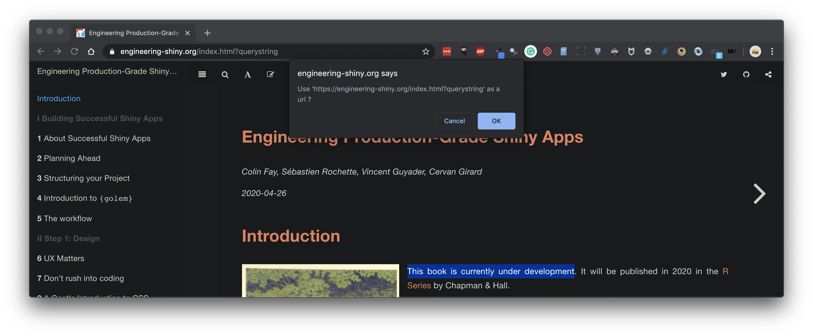
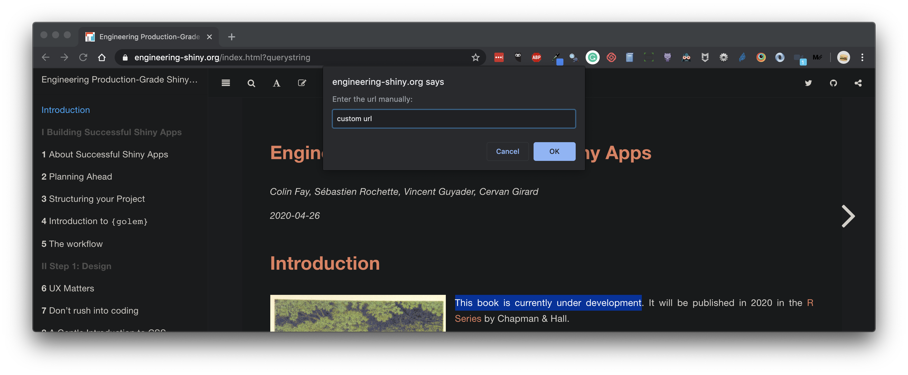
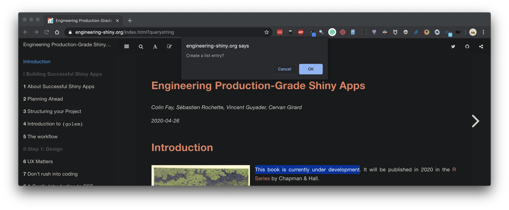
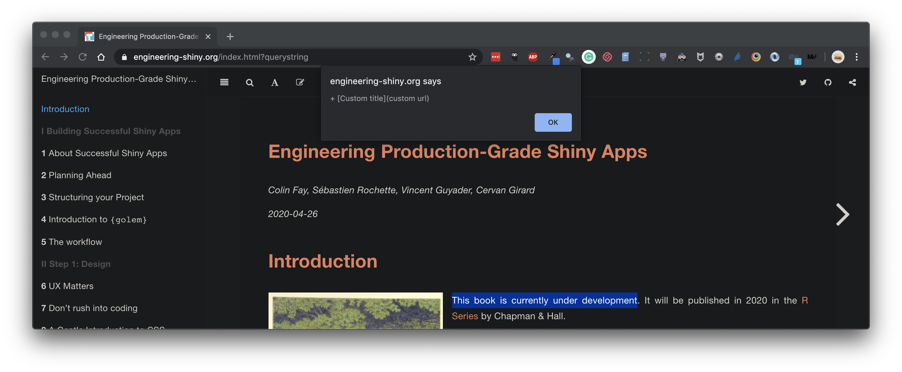
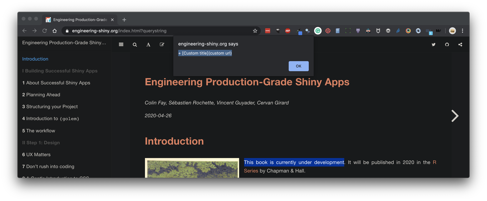

# mdlinks

A Google Chrome extension to create Markdown links from the current page, i.e:

```
+ [title](url)
```

## How to install

+ Download this repo

+ Go to More Tools > Extensions in Google Chrome

+ Click "load unpacked"

+ Select the folder on your machine

## How it works

When clicked: 

+ The selection (if any) will be suggested as a title



+ If you press cancel, the H1 will be suggested as a title


+ If you press cancel, the first h2 will be suggested as a title


+ If you press cancel, you can enter title by hand


+ The current url without query string is suggested as link


+ The current url is suggested as link



+ If you press cancel, you can enter url by hand



+ You can set the result as a markdown list entry (`+ []()`)



+ The title is displayed, you can then select, copy, and paste it



